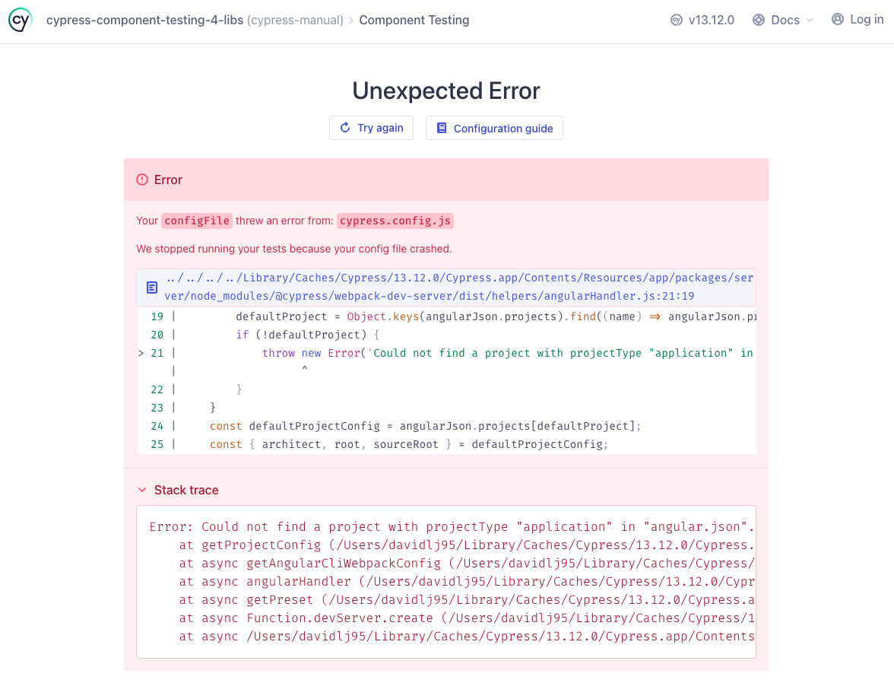
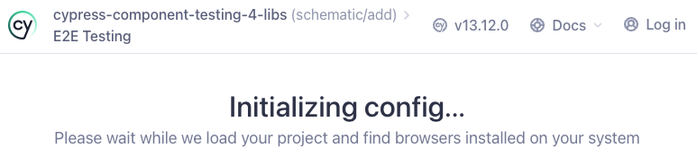
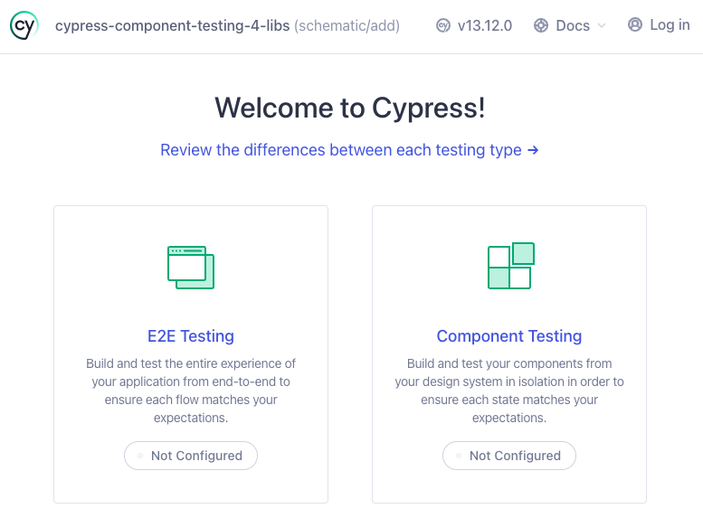
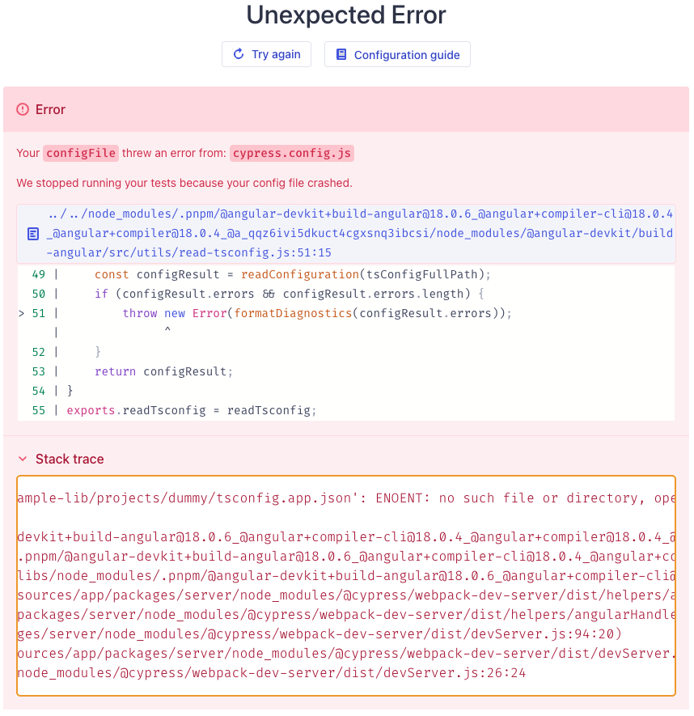
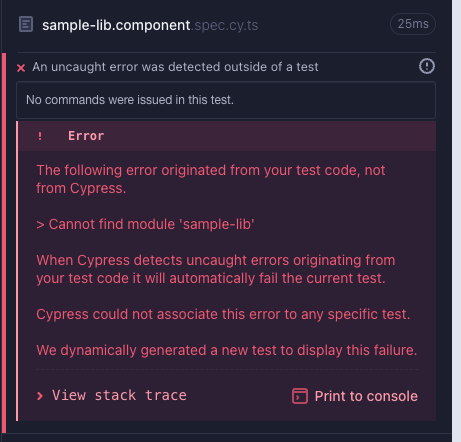

# CypressComponentTesting4Libs
This repository is an example of how to set up [Cypress Component Testing] for Angular workspaces hosting libraries

Seems that [Cypress is not ready for that use case by default yet](https://github.com/cypress-io/cypress/issues/23677) and there aren't docs about how to solve it. So providing here some examples on how it can be manually done

So to see how to set it up, [generated](#generation) an Angular CLI workspace and [sample library](./projects/sample-lib)

[gh-issue]: https://github.com/cypress-io/cypress/issues/23677
[gh-issue-config]: https://github.com/cypress-io/cypress/issues/23677#issuecomment-1386981377
[Cypress Component Testing]: https://docs.cypress.io/guides/component-testing/
[Cypress Angular options]: https://docs.cypress.io/guides/component-testing/angular/overview#Options-API
[Cypress Angular Schematic]: https://www.npmjs.com/package/@cypress/schematic

# TL;DR
## Recommended
[Manually install](#manual-install) Cypress & [generate a dummy app][manual/dummy-app]

## Alternative
[Manually install](#manual-install) Cypress & [configure Angular options][manual/config]

## Discouraged
Use of [Cypress Angular Schematic]. Seems very focused on apps & doesn't work for libraries.

# How-to
First, there are 2 ways of adding Cypress to your Angular project:

- Using [framework tooling](https://docs.cypress.io/plugins#framework-tooling). In this case, [Cypress Angular Schematic]
- Manually install & set up

## Manual install
Install Cypress with your package manager

```shell
pnpm i -D cypress
```

> [!NOTE]
> Checkout [`install/01-install` branch](https://github.com/davidlj95/angular-lib-cypress-component-testing/tree/install/01-install) to browse repo at that point

### Set up
Open Cypress by running in the root of the repository

```shell
cypress open
```

> [!TIP]
> You can also add an `npm` run script `cy:open`. See more in [docs about opening Cypress](https://docs.cypress.io/guides/getting-started/opening-the-app)

Configure component testing by tapping on it. Configuration files will be created in root of the repository.

> [!NOTE]
> Checkout [`install/02-open-auto-setup` branch](https://github.com/davidlj95/angular-lib-cypress-component-testing/tree/install/02-open-auto-setup) to browse repo at that point

However, the error of the [GitHub Issue][gh-issue] will appear:



<details>
<summary>Stack trace</summary>
<pre>
Error: Could not find a project with projectType "application" in "angular.json". Visit https://on.cypress.io/configuration to see how to pass in a custom project configuration
    at getProjectConfig (/Users/davidlj95/Library/Caches/Cypress/13.12.0/Cypress.app/Contents/Resources/app/packages/server/node_modules/@cypress/webpack-dev-server/dist/helpers/angularHandler.js:21:19)
    at async getAngularCliWebpackConfig (/Users/davidlj95/Library/Caches/Cypress/13.12.0/Cypress.app/Contents/Resources/app/packages/server/node_modules/@cypress/webpack-dev-server/dist/helpers/angularHandler.js:161:117)
    at async angularHandler (/Users/davidlj95/Library/Caches/Cypress/13.12.0/Cypress.app/Contents/Resources/app/packages/server/node_modules/@cypress/webpack-dev-server/dist/helpers/angularHandler.js:205:27)
    at async getPreset (/Users/davidlj95/Library/Caches/Cypress/13.12.0/Cypress.app/Contents/Resources/app/packages/server/node_modules/@cypress/webpack-dev-server/dist/devServer.js:94:20)
    at async Function.devServer.create (/Users/davidlj95/Library/Caches/Cypress/13.12.0/Cypress.app/Contents/Resources/app/packages/server/node_modules/@cypress/webpack-dev-server/dist/devServer.js:111:61)
    at async /Users/davidlj95/Library/Caches/Cypress/13.12.0/Cypress.app/Contents/Resources/app/packages/server/node_modules/@cypress/webpack-dev-server/dist/devServer.js:26:24
</pre>
</details>

To fix it, we can do two things:

### Dummy app
[manual/dummy-app]: #dummy-app

We can generate a dummy app so that Cypress reads Angular configuration from that app as suggested in the [GitHub issue][gh-issue]. For instance, using `ng generate`:

```shell
ng run g app dummy
```

Close Cypress & open it again. You'll be able to run tests 🎉

I think this is the simplest option to get it running & you don't have to maintain extra Cypress configuration. Also, you can have as many libraries in the Angular workspace as you want.

> [!WARN]
> You'll see that some files are compiled despite not needed:
> ```
> WARNING in /Users/davidlj95/Code/git/oss/cypress-component-testing-4-libs/projects/dummy/src/main.ts is part of the TypeScript compilation but it's unused.
> Add only entry points to the 'files' or 'include' properties in your tsconfig.
> ```
  
> [!NOTE]
> Checkout [`install/app/01-add` branch](https://github.com/davidlj95/angular-lib-cypress-component-testing/tree/install/app/01-add) to browse repo at that point

### Manual configuration
[manual/config]: #manual-configuration

[`cypress.config.ts` Angular options][Cypress Angular options] can be configured to solve the error. Here's the minimum magic options needed:

```typescript
export default defineConfig({
  component: {
    devServer: {
      framework: "angular",
      bundler: "webpack",
      options: {
        projectConfig: {
          root: "",
          sourceRoot: "",
          buildOptions: {},
        },
      },
    },
    specPattern: "**/*.cy.ts",
  },
});
```

Run `cypress open` and you'll be able to run tests now 🎉

This option is not so bad. The only con is that you have added some config to Cypress that you have to maintain over time. With the dummy app, if in the future support for testing Angular libs with Cypress is added, just updating Cypress would be enough. No need to update config. Also this config may not be valid in the future. On the other hand, not maintaining any config and removing a dummy app in case it's no longer need to run Cypress for libraries is quite straight forward to maintain.

> [!NOTE]
> Checkout [`install/manual/01-config` branch](https://github.com/davidlj95/angular-lib-cypress-component-testing/tree/install/manual/01-config) to browse repo at that point
 
## Using the schematic

Running `ng add @cypress/schematic` will:
 - Add sample library run configurations using `@cypress/schematic:cypress` builder in `angular.json`
 - Add a `cypress` directory inside the sample library directory
 - Add a `cypress.config.ts` inside the sample library directory
 - Add scripts to `package.json` to open Cypress

> [!NOTE]
> Checkout [`schematic/add` branch](https://github.com/davidlj95/angular-lib-cypress-component-testing/tree/schematic/01-add) to browse repo at that point

### Using added configurations
At that point, running `ng run sample-lib:cypress-open` ends up in an infinite loading screen:



Running any other configuration (for instance `ng run sample-lib:cypress-run`) turns into the following error:

```
Project target does not exist.
```

### Manual open
Running `cypress open` (or `pnpm run cypress:open`) from the root of the repo, results in a non-configured installation:



This makes sense, as the `cypress` configuration file & directory was created under `projects/sample-lib`. If changing directory there and running `cypress open` again, then we see that E2E & component testing has been configured.

However, if choosing component testing, following error appears:


<details>
<summary>Stack trace</summary>
<pre>
Error: Could not find a project with projectType "application" in "angular.json". Visit https://on.cypress.io/configuration to see how to pass in a custom project configuration
    at getProjectConfig (/Users/davidlj95/Library/Caches/Cypress/13.12.0/Cypress.app/Contents/Resources/app/packages/server/node_modules/@cypress/webpack-dev-server/dist/helpers/angularHandler.js:21:19)
    at async getAngularCliWebpackConfig (/Users/davidlj95/Library/Caches/Cypress/13.12.0/Cypress.app/Contents/Resources/app/packages/server/node_modules/@cypress/webpack-dev-server/dist/helpers/angularHandler.js:161:117)
    at async angularHandler (/Users/davidlj95/Library/Caches/Cypress/13.12.0/Cypress.app/Contents/Resources/app/packages/server/node_modules/@cypress/webpack-dev-server/dist/helpers/angularHandler.js:205:27)
    at async getPreset (/Users/davidlj95/Library/Caches/Cypress/13.12.0/Cypress.app/Contents/Resources/app/packages/server/node_modules/@cypress/webpack-dev-server/dist/devServer.js:94:20)
    at async Function.devServer.create (/Users/davidlj95/Library/Caches/Cypress/13.12.0/Cypress.app/Contents/Resources/app/packages/server/node_modules/@cypress/webpack-dev-server/dist/devServer.js:111:61)
    at async /Users/davidlj95/Library/Caches/Cypress/13.12.0/Cypress.app/Contents/Resources/app/packages/server/node_modules/@cypress/webpack-dev-server/dist/devServer.js:26:24
</pre>
</details>

Which is the original error in the [GitHub issue][gh-issue]

#### Dummy app
Tried adding a dummy app as suggested in the issue. Then, the error turns into trying to use `tsconfig.app.json` instead of `tsconfig.lib.json`:



<details>
<summary>Stack trace</summary>
<pre>
Error: error TS5012: Cannot read file '/Users/davidlj95/Code/git/oss/cypress-component-testing-4-libs/projects/sample-lib/projects/dummy/tsconfig.app.json': ENOENT: no such file or directory, open '/Users/davidlj95/Code/git/oss/cypress-component-testing-4-libs/projects/sample-lib/projects/dummy/tsconfig.app.json'.

    at readTsconfig (/Users/davidlj95/Code/git/oss/cypress-component-testing-4-libs/node_modules/.pnpm/@angular-devkit+build-angular@18.0.6_@angular+compiler-cli@18.0.4_@angular+compiler@18.0.4_@a_qqz6ivi5dkuct4cgxsnq3ibcsi/node_modules/@angular-devkit/build-angular/src/utils/read-tsconfig.js:51:15)
    at async generateWebpackConfig (/Users/davidlj95/Code/git/oss/cypress-component-testing-4-libs/node_modules/.pnpm/@angular-devkit+build-angular@18.0.6_@angular+compiler-cli@18.0.4_@angular+compiler@18.0.4_@a_qqz6ivi5dkuct4cgxsnq3ibcsi/node_modules/@angular-devkit/build-angular/src/utils/webpack-browser-config.js:47:22)
    at async generateBrowserWebpackConfigFromContext (/Users/davidlj95/Code/git/oss/cypress-component-testing-4-libs/node_modules/.pnpm/@angular-devkit+build-angular@18.0.6_@angular+compiler-cli@18.0.4_@angular+compiler@18.0.4_@a_qqz6ivi5dkuct4cgxsnq3ibcsi/node_modules/@angular-devkit/build-angular/src/utils/webpack-browser-config.js:117:20)
    at async getAngularCliWebpackConfig (/Users/davidlj95/Library/Caches/Cypress/13.12.0/Cypress.app/Contents/Resources/app/packages/server/node_modules/@cypress/webpack-dev-server/dist/helpers/angularHandler.js:165:24)
    at async angularHandler (/Users/davidlj95/Library/Caches/Cypress/13.12.0/Cypress.app/Contents/Resources/app/packages/server/node_modules/@cypress/webpack-dev-server/dist/helpers/angularHandler.js:205:27)
    at async getPreset (/Users/davidlj95/Library/Caches/Cypress/13.12.0/Cypress.app/Contents/Resources/app/packages/server/node_modules/@cypress/webpack-dev-server/dist/devServer.js:94:20)
    at async Function.devServer.create (/Users/davidlj95/Library/Caches/Cypress/13.12.0/Cypress.app/Contents/Resources/app/packages/server/node_modules/@cypress/webpack-dev-server/dist/devServer.js:111:61)
    at async /Users/davidlj95/Library/Caches/Cypress/13.12.0/Cypress.app/Contents/Resources/app/packages/server/node_modules/@cypress/webpack-dev-server/dist/devServer.js:26:24
</pre>
</details>

Tweaking the [Cypress Angular options] after adding the dummy app turned into looking for `tsconfig.json` instead. Seems a dead-end in there.

> [!NOTE]
> Checkout [`schematic/app/01-add` branch](https://github.com/davidlj95/angular-lib-cypress-component-testing/tree/schematic/app/01-add) to see repo at that point

#### Manually configuring Cypress Angular options
If [manually tweaking `cypress.config.ts` as suggested in the GitHub Issue][gh-issue-config] using [Cypress Angular options] without adding an app to the workspace achieved passing the Cypress first screen. You get to the Cypress UI, however, test setup fails:



<details>
<summary>Stack trace</summary>
<pre>
    at webpackMissingModule (http://localhost:8080/__cypress/src/spec-0.js:11:50)
    at 2988 (http://localhost:8080/__cypress/src/spec-0.js:11:135)
    at Function.__webpack_require__ (http://localhost:8080/__cypress/src/runtime.js:23:42)
    at _ZoneDelegate.invoke (http://localhost:8080/__cypress/src/default-node_modules_pnpm_cypress_13_12_0_node_modules_cypress_angular_dist_index_js.js:11807:158)
    at ZoneImpl.run (http://localhost:8080/__cypress/src/default-node_modules_pnpm_cypress_13_12_0_node_modules_cypress_angular_dist_index_js.js:11589:35)
    at <unknown> (http://localhost:8080/__cypress/src/default-node_modules_pnpm_cypress_13_12_0_node_modules_cypress_angular_dist_index_js.js:13842:30)
    at _ZoneDelegate.invokeTask (http://localhost:8080/__cypress/src/default-node_modules_pnpm_cypress_13_12_0_node_modules_cypress_angular_dist_index_js.js:11832:171)
    at ZoneImpl.runTask (http://localhost:8080/__cypress/src/default-node_modules_pnpm_cypress_13_12_0_node_modules_cypress_angular_dist_index_js.js:11635:37)
    at drainMicroTaskQueue (http://localhost:8080/__cypress/src/default-node_modules_pnpm_cypress_13_12_0_node_modules_cypress_angular_dist_index_js.js:12003:23)
From previous event:
    at Promise.longStackTracesCaptureStackTrace [as _captureStackTrace] (http://localhost:8080/__cypress/runner/cypress_runner.js:3486:19)
    at Promise._then (http://localhost:8080/__cypress/runner/cypress_runner.js:1239:17)
    at Promise.then (http://localhost:8080/__cypress/runner/cypress_runner.js:1132:17)
    at runScriptsFromUrls (http://localhost:8080/__cypress/runner/cypress_runner.js:111340:136)
    at Object.runScripts (http://localhost:8080/__cypress/runner/cypress_runner.js:111381:12)
    at $Cypress.onSpecWindow (http://localhost:8080/__cypress/runner/cypress_runner.js:40896:67)
    at init (http://localhost:8080/__cypress/src/cypress-entry.js:7831:11)
    at 8633 (http://localhost:8080/__cypress/src/cypress-entry.js:7889:3)
    at __webpack_require__ (http://localhost:8080/__cypress/src/runtime.js:23:42)
    at render (http://localhost:8080/__cypress/src/cypress-entry.js:7848:3)
    at 3304 (http://localhost:8080/__cypress/src/cypress-entry.js:7850:1)
    at __webpack_require__ (http://localhost:8080/__cypress/src/runtime.js:23:42)
    at __webpack_exec__ (http://localhost:8080/__cypress/src/cypress-entry.js:7896:48)
    at <unknown> (http://localhost:8080/__cypress/src/cypress-entry.js:7897:61)
    at webpackJsonpCallback (http://localhost:8080/__cypress/src/runtime.js:286:39)
    at <unknown> (http://localhost:8080/__cypress/src/cypress-entry.js:1:67)
</pre>
</details>

Played a bit tweaking the `cypress.config.ts` `devServer.options` but no luck.

> [!NOTE]
> Checkout [`schematic/manual/01-config` branch](https://github.com/davidlj95/angular-lib-cypress-component-testing/tree/schematic/manual/01-config) to browse repo at that point

## Generation
This project was generated with [Angular CLI](https://github.com/angular/angular-cli) version 18.0.6.

Exact command:
```shell
pnpm dlx @angular/cli new --package-manager=pnpm \
  --inline-style --inline-template --style css \
  --no-create-application cypress-component-testing-4-libs 
```

The library was generated using the following command
```shell
pnpm ng g lib sample-lib
```

## Development server

Run `ng serve` for a dev server. Navigate to `http://localhost:4200/`. The application will automatically reload if you change any of the source files.

## Code scaffolding

Run `ng generate component component-name` to generate a new component. You can also use `ng generate directive|pipe|service|class|guard|interface|enum|module`.

## Build

Run `ng build` to build the project. The build artifacts will be stored in the `dist/` directory.

## Running unit tests

Run `ng test` to execute the unit tests via [Karma](https://karma-runner.github.io).

## Running end-to-end tests

Run `ng e2e` to execute the end-to-end tests via a platform of your choice. To use this command, you need to first add a package that implements end-to-end testing capabilities.

## Further help

To get more help on the Angular CLI use `ng help` or go check out the [Angular CLI Overview and Command Reference](https://angular.dev/tools/cli) page.
